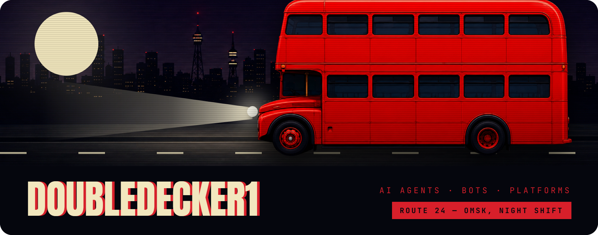
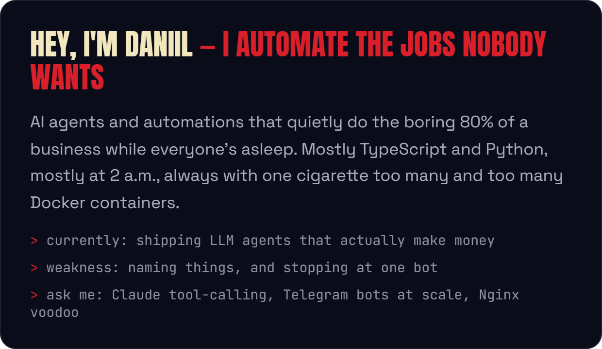
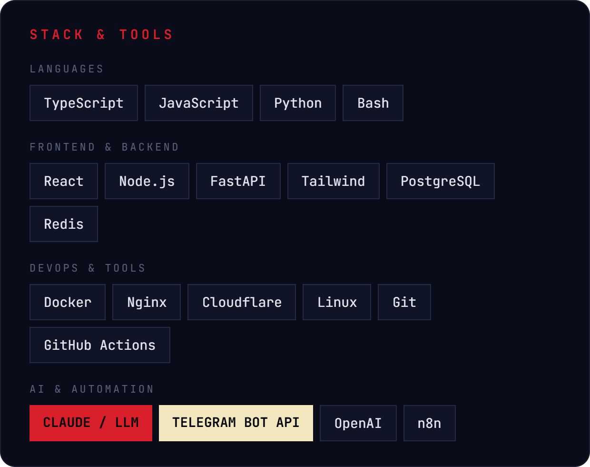
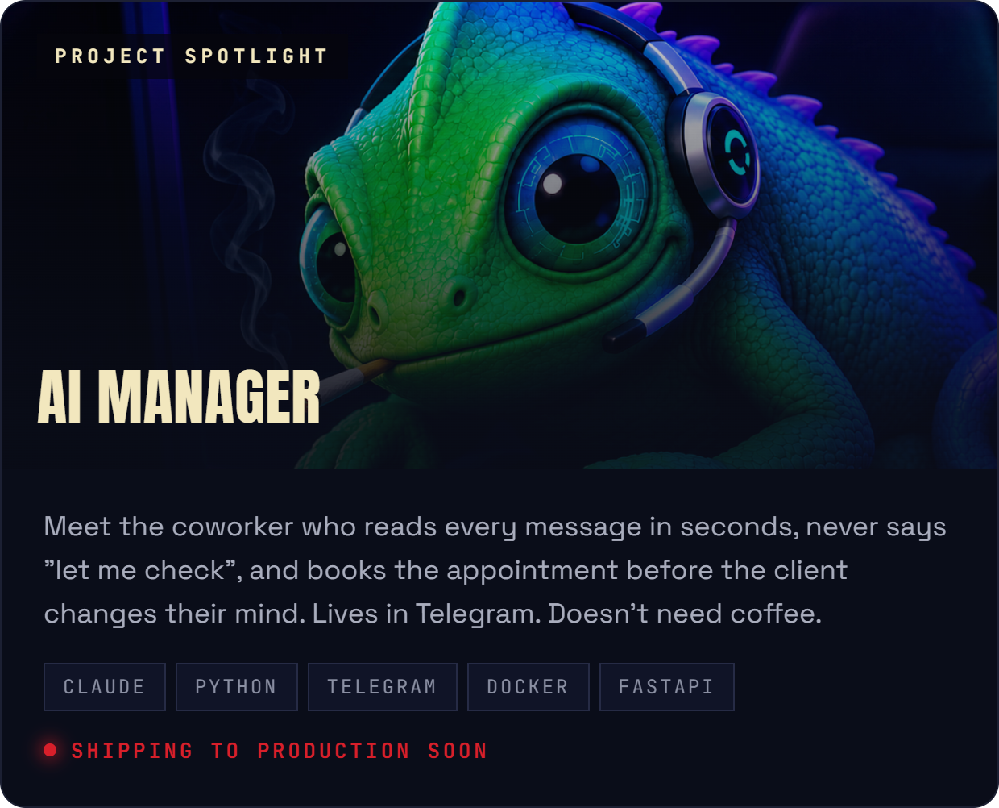

<!-- doubledecker1 · GitHub profile README — block layout -->

  

## NIGHT ARCADE

Pac-Man runs the night route through my contribution graph.

<!-- pacman -->
<picture>
  <source media="(prefers-color-scheme: dark)" srcset="https://raw.githubusercontent.com/doubledecker1/doubledecker1/output/pacman-contribution-graph-dark.svg">
  <source media="(prefers-color-scheme: light)" srcset="https://raw.githubusercontent.com/doubledecker1/doubledecker1/output/pacman-contribution-graph.svg">
  
</picture>

"Automate the boring. Ship what matters." — DD1
